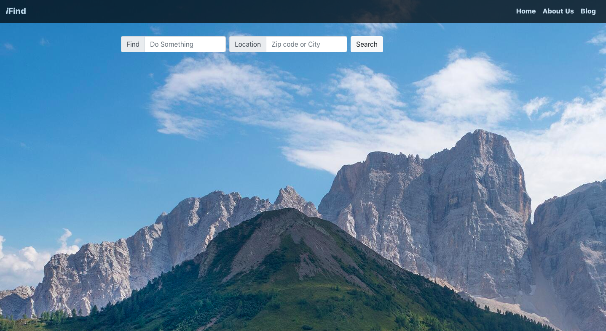

# ifind

A ReactJS web application where users can find places to eat or look for outdoor activities at their targeted location. It uses Yelp API to search for places and OpenWeatherMap API to get the real time wheather. 

## Common Setup 
Clone the repo and install the dependencies. 

```bash
git clone https://github.com/sophannaek/ifind.git
cd ifind/client
```

Use the package manager [npm](https://nodejs.org/en/download/) to install the dependency 
```bash
npm install
```
## Yelp API 
To get the Yelp API Key, visit [here](https://www.yelp.com/developers/documentation/v3/authentication)

## OpenWeatherMap API 
To get the OpenWeatherMap API, visit [here](https://openweathermap.org/api)

## Snapshots of the Application

Homepage 


Query page: Food


Query page: Hiking Place 
